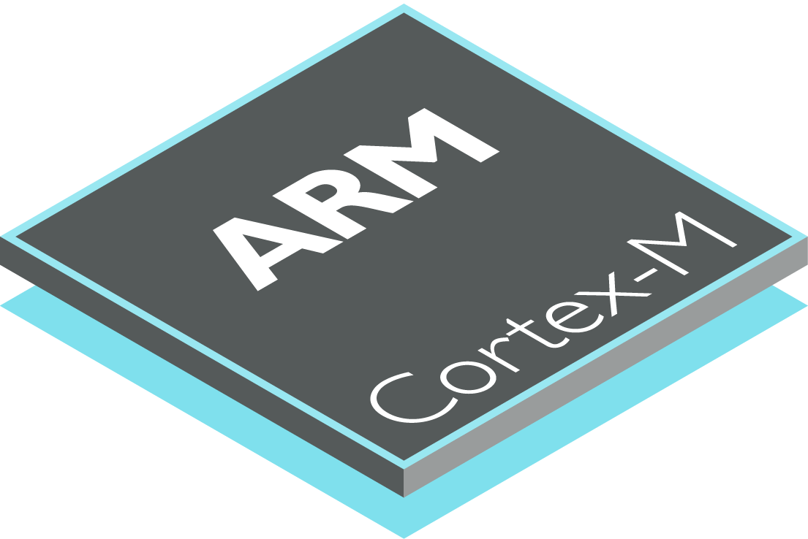

### Hi there, I'm Rizwan Ahmed - aka [Riz-Ahmed] 👋

- 🔭 I’m currently working on Software Development for Self - Driving Cars
- 🌱 I’m currently learning everything about Self - Driving Cars🤣
- 👯 I’m looking to collaborate with projects related to Self - Driving Cars
- 🥅 2020 Goals: Make speedy progress towards developing a functional Self - Driving Robot
- ⚡ Fun fact: There is no fun, only work!

### Connect with me:

[][youtube]
[][twitter]
[][linkedin]
[][instagram]

 

### Languages and Tools:

[][openSTM32]
[][Matlab]
[][Pyhton3]
[][Anaconda]
[][c-programming]
[][Arduino]
[][c-programming]
[][Ubuntu]
[][webdevplaylist]
[][webdevplaylist]
[][webdevplaylist]

 
 

---

### 📺 Latest YouTube Videos

<!-- YOUTUBE:START -->
- [UPDATE: Next Level GitHub Profile README (NEW) | GitHub Actions | Vercel | Spotify](https://www.youtube.com/watch?v=n6d4KHSKqGk)
- [SPEED RUN: Build a CRUD API with PrestoAPI & MongoDB Atlas in 9 Minutes! Then Airbnb Clone!](https://www.youtube.com/watch?v=6C45qCt41VY)
- [Building BATTLESHIPS Multiplayer Game with Node.js, Express, Socket.io, Heroku | (2/3)](https://www.youtube.com/watch?v=TpAwggQJPUQ)
- [GSAP Typing Animation | Tween & Timeline Basics (2020)](https://www.youtube.com/watch?v=ZT66N5hBiCE)
- [Next Level GitHub Profile README (NEW) | How To Create An Amazing Profile ReadMe With GitHub Actions](https://www.youtube.com/watch?v=ECuqb5Tv9qI)
<!-- YOUTUBE:END -->

➡️ [more videos...](https://youtube.com/codestackr)

---

### 📕 Latest Blog Posts

<!-- BLOG-POST-LIST:START -->
- [Microinteractions: Password Validation Animation](https://dev.to/codestackr/microinteractions-password-validation-animation-5629)
- [Notion + YouTube - A Powerful Combination for Productivity](https://dev.to/codestackr/notion-youtube-a-powerful-combination-for-productivity-1def)
- [Regular Expressions (RegEx) Crash Course](https://dev.to/codestackr/regular-expressions-regex-crash-course-248n)
- [Emmet Part 2 - Advanced](https://dev.to/codestackr/emmet-part-2-advanced-4c65)
- [Deno 1.0 Released! (Easy) REST API Example](https://dev.to/codestackr/deno-1-0-released-easy-rest-api-example-2fbl)
<!-- BLOG-POST-LIST:END -->

➡️ [more blog posts...](https://codestackr.com)

---

  
:zap: Recent Github Activity

<!--START_SECTION:activity-->
1. 🗣 Commented on [#249](https://github.com//abhisheknaiidu/awesome-github-profile-readme/issues/249) in [abhisheknaiidu/awesome-github-profile-readme](https://github.com//abhisheknaiidu/awesome-github-profile-readme)
2. 🗣 Commented on [#249](https://github.com//abhisheknaiidu/awesome-github-profile-readme/issues/249) in [abhisheknaiidu/awesome-github-profile-readme](https://github.com//abhisheknaiidu/awesome-github-profile-readme)
3. 💪 Opened PR [#249](https://github.com//abhisheknaiidu/awesome-github-profile-readme/pull/249) in [abhisheknaiidu/awesome-github-profile-readme](https://github.com//abhisheknaiidu/awesome-github-profile-readme)
4. ❗️ Closed issue [#9](https://github.com//jamesgeorge007/github-activity-readme/issues/9) in [jamesgeorge007/github-activity-readme](https://github.com//jamesgeorge007/github-activity-readme)
5. 🗣 Commented on [#9](https://github.com//jamesgeorge007/github-activity-readme/issues/9) in [jamesgeorge007/github-activity-readme](https://github.com//jamesgeorge007/github-activity-readme)
<!--END_SECTION:activity-->

  
:zap: Github Stats

  

[website]: https://codeSTACKr.com
[twitter]: https://twitter.com/rizwana77519342
[youtube]: https://www.youtube.com/channel/UCN_8m-6EmrS6G-lMBzyoudA?view_as=subscriber
[instagram]: https://www.instagram.com/rizahmed89/?hl=en
[linkedin]: https://www.linkedin.com/in/rizwan-ahmed-35761224/
[openSTM32]: https://www.openstm32.org/HomePage
[Matlab]: https://www.mathworks.com/products/matlab.html
[Matlab]: https://www.mathworks.com/products/matlab.html
[Pyhton3]: https://www.python.org/download/releases/3.0/
[Anaconda]: https://www.anaconda.com/
[c-programming]: https://devdocs.io/c/
[Arduino]: https://www.arduino.cc/
[Ubuntu]: https://ubuntu.com/
[webdevplaylist]: https://www.youtube.com/playlist?list=PLkwxH9e_vrAJ0WbEsFA9W3I1W-g_BTsbt
[jsplaylist]: https://www.youtube.com/playlist?list=PLkwxH9e_vrALRJKu7wfXby3MKeflhTu6B
[cssplaylist]: https://www.youtube.com/playlist?list=PLkwxH9e_vrALSdvZuEh6gqQdmDoDIoqz4
[reactplaylist]: https://www.youtube.com/playlist?list=PLkwxH9e_vrAK4TdffpxKY3QGyHCpxFcQ0
